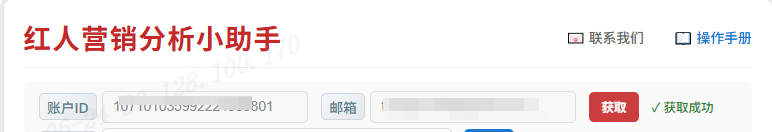
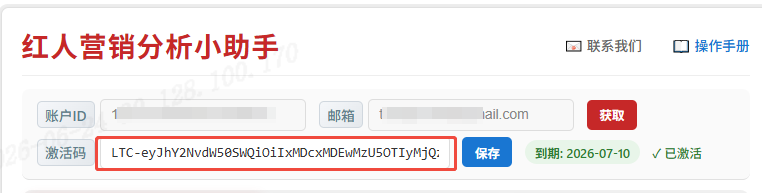

# Instagram 红人分析工具 - 详细操作手册

## 目录

1. [快速开始](#快速开始)
2. [激活流程](#激活流程)
3. [界面介绍](#界面介绍)
4. [功能一：红人寻找（Tagged）](#功能一红人寻找tagged)
5. [功能二：红人画像（Reels）](#功能二红人画像reels)
6. [功能三：相似红人（Similar）](#功能三相似红人similar)
7. [数据导出说明](#数据导出说明)
8. [常见问题](#常见问题)

---

## 快速开始

### 1. 安装扩展

1. 打开 Chrome 浏览器
2. 访问 `chrome://extensions/`
3. 开启「开发者模式」（右上角开关）
4. 点击「加载已解压的扩展程序」
5. 选择项目中的 `release` 文件夹

### 2. 打开工具

1. **必须先打开 Instagram 网站**（如 `https://www.instagram.com/`）
2. 点击 Chrome 工具栏中的扩展图标
3. 侧边栏会从右侧弹出

---

## 激活流程

### 为什么需要激活？

激活后可以解锁完整功能，包括无限次分析和数据导出。未激活状态下部分功能可能受限。

### 完整激活步骤

```
用户获取账户信息 → 联系客服付费 → 客服生成激活码 → 用户输入激活码 → 完成激活
```

#### 步骤 1：获取账户信息

1. 打开工具侧边栏
2. 找到底部的「账户 ID」和「邮箱」输入框
3. 点击「获取账户」按钮
4. 系统会自动填充你的账户 ID 和邮箱地址



**注意：**
- 如果显示「无权限获取」，表示你的浏览器没有授予相关权限
- 请确保已登录 Google 账户

#### 步骤 2：联系客服

1. 将获取到的 **账户 ID** 和 **邮箱** 发送给客服
2. 客服确认信息后，会为你生成专属激活码
3. 客服会将激活码发送给你
   
#### 步骤 3：输入激活码

1. 在侧边栏底部找到「激活码」输入框
2. 输入客服提供的激活码
3. 点击「保存」按钮
   
#### 步骤 4：确认激活成功

- 激活成功后，会显示：`✓ 已激活`
- 同时显示到期日期：`到期: YYYY-MM-DD`
- 如果激活码即将到期（7天内），会显示警告提示

### 激活状态说明

| 状态 | 显示 | 说明 |
|------|------|------|
| ✅ 已激活 | `✓ 已激活` + 到期日期 | 功能完全解锁 |
| ⚠️ 即将到期 | `⚠️ 剩X天` | 请及时联系客服续费 |
| ❌ 已过期 | `❌ 已过期` | 需要重新激活 |
| ❌ 无效 | `❌ 无效` | 激活码不正确 |

### 激活码格式

- 激活码由字母、数字和特殊字符组成
- 长度通常为 16-32 位
- 示例：`ABC123-DEF456-GHI789-JKL012`

### 常见问题

**Q：点击「获取账户」没反应？**

确保已登录 Google 账户，并在浏览器设置中允许扩展访问你的账户信息。

**Q：激活码显示无效？**

请检查：
1. 激活码是否输入正确（注意大小写）
2. 是否使用了其他人的激活码（激活码与账户绑定）
3. 联系客服确认激活码是否有效

---

## 界面介绍

### 侧边栏布局

```
┌─────────────────────────────────┐
│  📊 Instagram 红人分析工具        │
├─────────────────────────────────┤
│  [红人寻找] [红人画像] [相似红人]   │  ← 三个功能标签页
├─────────────────────────────────┤
│  ┌─────────────────────────┐    │
│  │ 页面状态: ✅/❌ 提示信息   │    │  ← 页面检测状态
│  └─────────────────────────┘    │
│  ┌─────────────────────────┐    │
│  │ 统计信息区域            │    │  ← 分析进度和结果统计
│  └─────────────────────────┘    │
│  ┌─────────────────────────┐    │
│  │ [开始分析] [停止] [导出]  │    │  ← 操作按钮
│  └─────────────────────────┘    │
│  ┌─────────────────────────┐    │
│  │ 📋 日志区域             │    │  ← 实时操作日志
│  └─────────────────────────┘    │
├─────────────────────────────────┤
│  激活码输入框 + 获取账户按钮      │
└─────────────────────────────────┘
```

### 状态指示灯说明

| 状态 | 图标 | 含义 | 操作 |
|------|------|------|------|
| ✅ 有效 | 绿色 | 当前页面符合分析要求 | 可以点击「开始分析」 |
| ❌ 无效 | 红色 | 当前页面不符合分析要求 | 需要切换到正确页面 |

### 按钮状态说明

| 按钮 | 可用条件 | 不可用条件 |
|------|----------|------------|
| **开始分析** | 页面有效 + 未在分析中 | 页面无效 或 正在分析 |
| **停止** | 正在分析中 | 未在分析 |
| **导出 CSV** | 有分析结果 | 无分析结果 |

---

## 功能一：红人寻找（Tagged）

### 功能说明

自动访问目标用户的 **Tagged 页面**（被标记页面），滚动收集所有帖子链接，然后逐一分析每个帖子的发布者信息。

**分析流程：**
```
打开 Tagged 页面 → 滚动收集帖子链接 → 逐一访问帖子 → 提取发布者信息 → 汇总结果
```

### 前置页面检测

**必须满足：**
- 当前页面 URL 必须包含 `/tagged/`
- 示例正确 URL：`https://www.instagram.com/用户名/tagged/`

**检测逻辑：**
1. 快速判断：检查 URL 是否包含 `/tagged/`
2. 如果快速判断失败，会通过 content script 进一步验证页面内容

**不符合要求时：**
- 状态显示 ❌ 红色
- 「开始分析」按钮变灰不可点击
- 提示：`请打开 Instagram Tagged 页面，例如: instagram.com/username/tagged/`

### 使用步骤

#### 步骤 1：打开正确的页面

1. 在 Instagram 中搜索或导航到目标用户
2. 点击用户主页的「Tagged」标签
3. 确认 URL 包含 `/tagged/`

#### 步骤 2：打开工具侧边栏

#### 步骤 3：切换到「红人寻找」标签页

#### 步骤 4：确认页面状态

- 等待状态变为 ✅ 绿色
- 如果显示 ❌，请检查 URL 是否正确

#### 步骤 5：点击「开始分析」按钮

**系统执行以下操作：**
1. 开始自动滚动页面收集帖子链接
2. 日志区域显示：`[滚动第 X 次] 收集到 Y 个帖子`
3. 收集完成后自动逐一访问每个帖子
4. 提取每个帖子发布者的详细信息

#### 步骤 6：等待分析完成

**分析过程中可以看到：**
- 进度条显示收集/分析进度
- 日志实时更新操作状态
- 统计数字实时更新

#### 步骤 7：停止分析（可选）

点击「停止」按钮：
- 立即停止滚动收集
- 已收集的帖子会继续分析完成
- 已分析的数据会保留

### 分析阈值

| 阈值项 | 默认值 | 说明 |
|--------|--------|------|
| 滚动检测次数 | 5 次 | 连续 5 次滚动无新内容则停止收集 |
| 帖子去重 | 自动 | 使用 Set 自动去重，避免重复分析 |

### 最终获取的数据

| 字段 | 说明 | 示例 |
|------|------|------|
| username | 用户名 | `@john_doe` |
| nickname | 昵称 | `John Doe` |
| followers | 粉丝数 | `12500` |
| email | 邮箱地址 | `john@example.com` |
| location | 所在地 | `New York` |
| url | 主页链接 | `https://instagram.com/john_doe` |

---

## 功能二：红人画像（Reels）

### 功能说明

分析目标用户的 **Reels（短视频）** 数据，提取统计信息。

**分析流程：**
```
打开用户主页 → 点击 Reels 图标 → 收集视频数据 → 计算平均值 → 显示结果
```

### 前置页面检测

**必须满足：**
- 当前页面是用户主页（Profile Page）
- URL 格式：`https://www.instagram.com/用户名/`

**检测逻辑：**
- 使用 `isProfilePage(url)` 判断是否为用户主页

**不符合要求时：**
- 状态显示 ❌ 红色
- 提示：`请打开用户主页，例如: instagram.com/username`

### 使用步骤

#### 步骤 1：打开用户主页

1. 在 Instagram 中搜索目标用户
2. 进入用户个人主页
3. 确认 URL 格式正确

#### 步骤 2：打开工具侧边栏

#### 步骤 3：切换到「红人画像」标签页

#### 步骤 4：点击页面上的「Reels」图标

> **重要**：必须先在 Instagram 页面上点击 Reels 图标，进入 Reels 列表页面

#### 步骤 5：确认页面状态

- 等待状态变为 ✅ 绿色

#### 步骤 6：点击「开始分析」按钮

**系统执行以下操作：**
1. 提取页面已有的 Reels 数据
2. 自动滚动页面加载更多 Reels
3. 通过网络请求拦截器收集数据
4. 计算统计平均值

#### 步骤 7：等待分析完成

**分析过程中可以看到：**
- 日志显示：`收集到 Reels: XXXX - 播放:XXX 评论:XXX 点赞:XXX`
- 过滤置顶帖子的提示

#### 步骤 8：停止分析（可选）

点击「停止」按钮：
- 停止继续加载新的 Reels
- 已收集的数据会保留
- 可以导出已收集的数据

### 分析阈值

| 阈值项 | 默认值 | 说明 |
|--------|--------|------|
| 最大 Reels 数量 | 100 条 | 最多收集 100 条 Reels |
| 置顶过滤 | 自动 | 自动过滤置顶帖子，只计算普通 Reels 的平均值 |
| 滚动检测次数 | 5 次 | 连续 5 次滚动无新内容则停止 |

### 最终获取的数据

| 字段 | 说明 | 示例 |
|------|------|------|
| followers | 粉丝数 | `50000` |
| avgPlayCount | 平均播放数 | `125000` |
| avgCommentCount | 平均评论数 | `850` |
| avgLikeCount | 平均点赞数 | `5200` |
| count | 分析帖子数 | `45` |

---

## 功能三：相似红人（Similar）

### 功能说明

通过目标用户的「类似账户」推荐列表，收集并分析相似的红人用户。

**分析流程：**
```
打开用户主页 → 点击「类似账户」→ 循环收集用户 → 逐一分析详细信息 → 汇总结果
```

### 前置页面检测

**必须满足：**
- 当前页面是用户主页（Profile Page）
- URL 格式：`https://www.instagram.com/用户名/`

**检测逻辑：**
- 使用 `isProfilePage(url)` 判断是否为用户主页

**不符合要求时：**
- 状态显示 ❌ 红色
- 提示：`请打开用户主页后点击开始分析`

### 使用步骤

#### 步骤 1：打开用户主页

1. 在 Instagram 中搜索目标用户
2. 进入用户个人主页

#### 步骤 2：打开工具侧边栏

#### 步骤 3：切换到「相似红人」标签页

#### 步骤 4：确认页面状态

- 等待状态变为 ✅ 绿色

#### 步骤 5：点击「开始分析」按钮

**系统执行以下操作：**
1. **自动点击「类似账户」按钮**（Instagram 页面上的按钮）
2. 等待弹窗出现（约 3 秒）
3. 收集当前页面的相似用户
4. 点击「下一步」按钮翻页
5. 重复收集直到达到阈值或无新内容

#### 步骤 6：等待分析完成

**分析过程中可以看到：**
- 日志显示：`收集到用户: username ✓`（✓ 表示已认证）
- 当前页数和累计数量
- 自动关闭弹窗

#### 步骤 7：停止分析（可选）

点击「停止」按钮：
- 立即停止收集和分析
- 已收集的数据会保留
- 可以导出已收集的数据

### 分析阈值

| 阈值项 | 默认值 | 说明 |
|--------|--------|------|
| 最大账户数 | 500 个 | 最多收集 500 个相似红人 |
| 连续无新增停止 | 5 页 | 连续 5 页无新用户则停止 |
| 翻页等待时间 | 1.5-3 秒 | 随机延迟避免触发限制 |

### 最终获取的数据

| 字段 | 说明 | 示例 |
|------|------|------|
| username | 用户名 | `@jane_smith` |
| nickname | 昵称 | `Jane Smith` |
| verified | 是否认证 | `是` / `否` |
| followers | 粉丝数 | `25000` |
| email | 邮箱地址 | `jane@example.com` |
| location | 所在地 | `Los Angeles` |
| url | 主页链接 | `https://instagram.com/jane_smith` |

---

## 数据导出说明

### 导出格式

所有功能都支持导出为 **CSV 格式**，可以直接用 Excel 或 Google Sheets 打开。

### 导出按钮位置

| 功能 | 按钮 ID | 位置 |
|------|---------|------|
| 红人寻找 | `btnExportCSV` | Tab 1 |
| 红人画像 | `btnExportCSV2` | Tab 2 |
| 相似红人 | `btnExportCSV3` | Tab 3 |

### 导出文件名格式

```
instagram_tagged_report_YYYY-MM-DD.csv    (红人寻找)
instagram_reels_report_YYYY-MM-DD.csv     (红人画像)
similar_accounts_YYYY-MM-DD.csv           (相似红人)
```

### 导出注意事项

1. **导出按钮可用条件**：必须有分析结果才能导出
2. **乱码问题**：如果用记事本打开出现乱码，请用 Excel 打开
3. **数据完整性**：导出的是当前已收集的所有数据

---

## 常见问题

### Q1：点击图标打不开侧边栏？

**解决方法：**
1. 确保已打开 Instagram 页面
2. 在 `chrome://extensions/` 页面重新加载扩展
3. 检查扩展权限设置

### Q2：状态一直显示 ❌？

**解决方法：**
1. 检查当前页面 URL 是否正确
2. 确保在正确的页面类型（Tagged/Profile）
3. 刷新页面后重试

### Q3：开始分析后没有反应？

**可能原因：**
1. 网络延迟，等待几秒
2. Instagram 页面加载未完成
3. 检查浏览器控制台是否有错误（F12）

### Q4：分析过程中卡住？

**解决方法：**
1. 点击「停止」按钮
2. 刷新 Instagram 页面
3. 重新开始分析

### Q5：导出 CSV 后数据不完整？

**可能原因：**
1. 分析还未完成就导出
2. 网络中断导致部分数据丢失
3. 重新分析后再次导出

### Q6：提示「未找到类似账户按钮」？

**解决方法：**
1. 确保在用户主页（不是 Tagged/Reels 页面）
2. 页面可能还在加载中，等待几秒
3. 刷新页面后重试

---

## 操作流程图

```
┌─────────────────────────────────────────────────────────────┐
│                    打开工具侧边栏                            │
└─────────────────────────────────────────────────────────────┘
                            ↓
┌─────────────────────────────────────────────────────────────┐
│              选择功能标签页 (红人寻找/红人画像/相似红人)         │
└─────────────────────────────────────────────────────────────┘
                            ↓
┌─────────────────────────────────────────────────────────────┐
│              页面检测 ✅/❌                                  │
│  ✅ → 开始分析按钮可用                                       │
│  ❌ → 提示切换页面，按钮不可用                                │
└─────────────────────────────────────────────────────────────┘
                            ↓ (✅)
┌─────────────────────────────────────────────────────────────┐
│              点击「开始分析」                                 │
│  → 自动滚动收集数据                                         │
│  → 实时更新日志和进度                                        │
│  → 提取分析目标信息                                         │
└─────────────────────────────────────────────────────────────┘
                            ↓
┌─────────────────────────────────────────────────────────────┐
│              分析完成 / 点击「停止」                          │
│  → 统计结果显示                                             │
│  → 导出按钮变为可用                                         │
└─────────────────────────────────────────────────────────────┘
                            ↓
┌─────────────────────────────────────────────────────────────┐
│              点击「导出 CSV」下载数据                          │
└─────────────────────────────────────────────────────────────┘
```

---

*文档版本：v1.0 | 最后更新：2026年*
