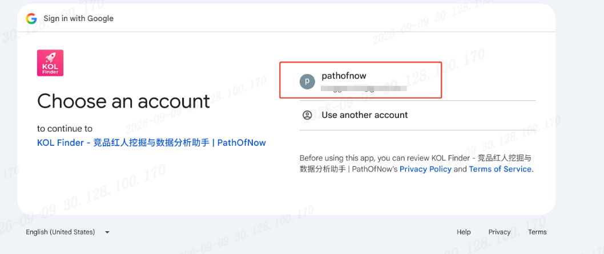
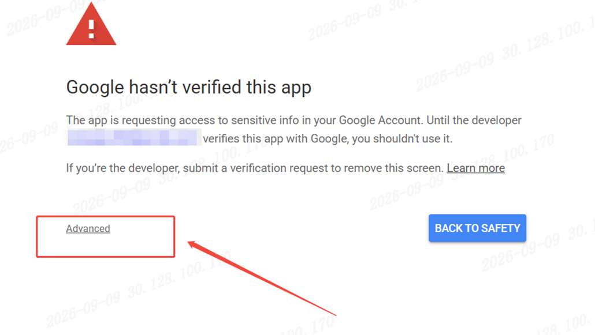
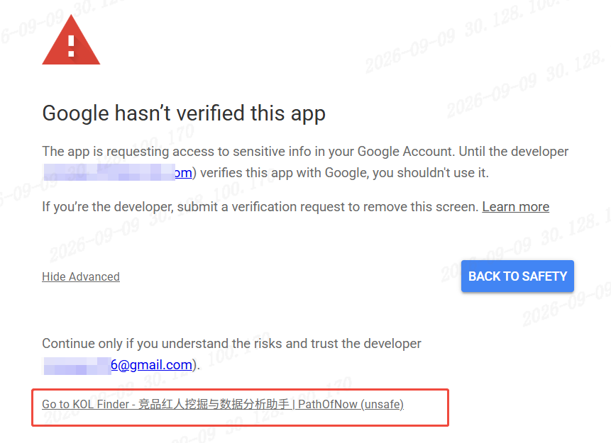
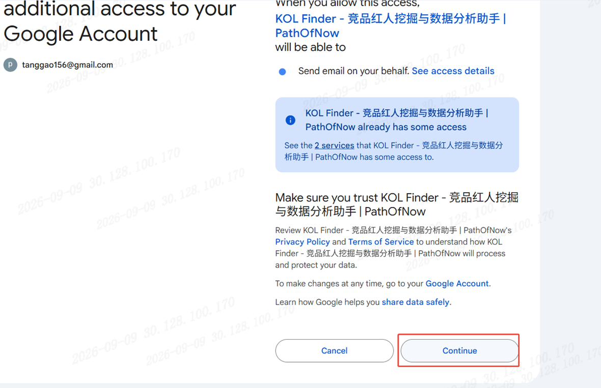
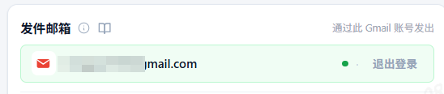

# 邮件群发平台 · 从 0 到 1 使用指南

## 一、功能简介

本平台是一个 Chrome 侧边栏扩展功能，用你的 Gmail 账号批量发送邮件。支持两种发送方式：
- **直接发送**：表格自带邮箱、主题和正文列，逐行直接发送
- **模板发送**：预先保存主题/正文模板，用表格中的列值填充 `{占位符}`

所有模板配置和任务状态仅保存在浏览器本地缓存中，**服务端不采集任何邮箱或邮件内容敏感数据**。

发送过程中即使关闭侧边栏或电脑锁屏，下次打开侧边栏会自动提示是否恢复未完成的任务。

---

## 二、从 0 到 1 使用流程

### 第 1 步：登录 Gmail 账号

1. 切换平台到「KOL建联」→ 进入「邮件群发引擎」Tab

2. 点击「登录 Gmail 账号」按钮

3. 弹出 Google 授权窗口，选择你的 Gmail 账号并同意发送权限

     初次登录时，Google 会弹出安全提示，只需按照以下 4 步点击即可完成登录：

    1. **选择账号**：点击您的 谷歌/Gmail 账号。

        

    2. **展开高级设置**：看到红色感叹号页面时，点击左下角的 **`Advanced`（高级）**。

       

    3. **确认继续**：页面展开后，点击底部的 **`Go to KOL Finder... (unsafe)`** 进入授权。

       

    4. **授予权限**：点击右下角 **`Continue`（继续）**，即可完成登录并开始使用！

       

       >请您放心使用！这是由于 KOL Finder 采用了**本地数据直连技术**，所有邮件均由您的本地浏览器直接发出，**我们不会在云端存储您的任何 Gmail 账号数据**。也正因如此，软件未申请 Google 的企业级云端商业认证（该认证要求将数据上传至第三方服务器审查）。提示仅代表软件未做商业云端备案，完全不影响您的账号安全，按照指引点击 `Advanced` ---> `Go to...` 即可正常使用。

       

4. 授权后显示账号邮箱和「已连接」状态

    

**退出登录**：点击右下角「退出登录」链接，会清除本机授权缓存。下次登录时可选择其他 Google 账号。

### 第 2 步：准备发送素材

表格格式要求：
- 文件类型：`.xlsx` 或 `.csv`
- 第一行为表头，从第二行起每行发送 1 封邮件
- 必须有一列列名包含 `邮箱`（作为收件地址）
- 其他列可在主题/正文模板中用 `{列名}` 引用

#### 模板发送

示例表结构（**模板发送，只需要邮箱和占位符列**）：

| 邮箱 | 昵称 | 粉丝数 | 平均互动率 | 红人简介 |
|-------|------|----------|----------|----------|
| a@xx.com | McKenna Lynn | Alice | 2.2% | xxxx |
| b@xx.com | zz | Bob | 2.2% | xxxxxxx |

> 模板示例：
>
> 主题 : 合作邀请 - **{昵称}**
>
> 正文 : 嗨 **{{昵称}}**！
>
> 看到你写得“{{用户简介}}”，就知道你的粉丝群体跟我们的产品非常契合。
>
> 凭借你 **{{粉丝数}}** 的账号体量和 **{{平均互动率}}** 的强互动，你的种草说服力非常强。我们现在有一个高佣金的带货计划，你只需要挂个专属折扣链接，粉丝下单你就能直接拿提成。我们负责提供所有精美的图片和文案，你完全不需要写稿，轻松又省心。
>
> 有兴趣了解的话，**直接回复“1”**，我马上把详细的资料和样品方案发你！

#### 直接发送

示例表结构：

| 邮箱     | 主题     | 正文                |
| -------- | -------- | ------------------- |
| a@xx.com | 合作邀请 | 你好 Alice，希望... |
| b@xx.com | 合作邀请 | 你好 Bob，希望...   |

### 第 3 步：配置模板（仅模板发送需要）

1. 切换到「发送模板配置」Tab
2. 填写邮件主题模板和正文模板，支持 `{列名}` 变量
3. 点击「保存模板」→ 保存到浏览器本地缓存
4. 下次使用无需重复填写，直接在「邮件群发」Tab 选择「模板发送」即可

**隐私说明**：模板仅保存在本机浏览器扩展缓存中，服务端不会采集任何邮箱或邮件内容数据。

### 第 4 步：选择发送模式并预览

回到「邮件群发」Tab，在「发送模式与预览」区：

1. 选择发送模式：
   - **直接发送**：表格须含邮箱/主题/正文列，逐行直接用表格内容发送
   - **模板发送**：使用已保存模板，表格须含模板中所有 `{占位符}` 对应的列

2. 校验提示：
   - ✓ 绿色提示 = 校验通过，可开始发送
   - ✕ 红色提示 = 缺少列或占位符不匹配，需补充表格或修改模板

3. 发送内容预览：
   - 导入文件后会自动显示第一条邮件预览（收件邮箱、主题、正文）
   - 点击「‹ 上一条」/「下一条 ›」翻动浏览
   - 第一条禁用「上一条」，最后一条禁用「下一条」
   - 位置显示「N / M」当前索引/总数

### 第 5 步：设置发送参数并开始发送

1. 设置「发送间隔（秒/封）」：建议 30 秒以上，避免被 Gmail 限流
2. 设置「每日上限（封）」：默认 50，达到后自动停止
3. 点击「开始发送」→ 进入发送循环
4. 状态栏显示进度（如 `已发送 5/30`）
5. 日志区逐条显示成功/失败明细

**发送控制**：
- 「暂停」：暂停发送，可点「继续」恢复
- 「停止」：停止发送，已发送的不会重复

---

## 三、异常恢复机制

发送过程中如果发生意外中断，本功能会自动保存进度并在下次打开侧边栏时恢复。

### 触发异常恢复的场景

1. **关闭侧边栏**：发送中关闭侧边栏 → JS 上下文销毁 → 下次打开侧边栏自动弹窗提示
2. **电脑锁屏后关闭侧边栏**：锁屏期间侧边栏未关闭时，Chrome 会节流定时器但不销毁上下文，解锁后发送自然继续；如果在锁屏期间关闭了侧边栏，靠 `chrome.storage.local` 持久化在重开时恢复
3. **Gmail 授权失效**：发送中返回 401 → 自动暂停 → 提示重新授权 → 重新登录后点「继续」
4. **网络波动**：单封发送失败自动跳过，不停止整个任务

### 恢复流程

1. 每封邮件发送后（成功或失败）立即将剩余队列保存到 `chrome.storage.local`
2. 下次打开侧边栏 → 自动检测到未完成任务 → 弹窗显示「剩余 N 封，已成功 M 封，失败 K 封」
3. 点「继续」→ 自动切回邮件 Tab → 恢复队列和配置 → 验证 token → 重启发送循环
4. 点「放弃」→ 清除任务状态 → 可重新开始

### 异常恢复时的日限检查

恢复时会检查今日已发送数是否达日限：若已达限，任务自动结束，不会超发。

---

## 四、字段识别规则

| 字段 | 识别列名（不区分大小写） |
|------|------------------------|
| 收件邮箱 | email、邮箱、e-mail、mail、emailaddress |
| 主题 | subject、主题、邮件主题 |
| 正文 | body、content、正文、邮件内容、message |

一个单元格含多个邮箱时取第一个。

---

## 五、模板语法

- 用 `{列名}` 引用表格列值，如 `{name}`、`{username}`
- 发送时自动替换为该行对应列的内容
- 列名不区分大小写、忽略首尾空格
- 模板发送时，模板中所有占位符必须能在表格中找到对应列，否则校验不通过

---

## 六、常见问题

**Q：直接发送和模板发送的区别？**
A：直接发送用表格里的主题/正文列；模板发送用已保存的模板+表格占位符替换。

**Q：模板保存在哪里？会被上传吗？**
A：模板保存在 Chrome 浏览器本地扩展缓存中，不会上传服务端，不采集任何邮箱敏感数据。

**Q：发送失败的邮件会重发吗？**
A：不会，失败自动跳过，不重复发送。失败原因见日志区。

**Q：如何切换 Gmail 发件账号？**
A：点「退出登录」清除本机授权缓存，再点「登录 Gmail 账号」，在弹窗中选择其他 Google 账号。

**Q：锁屏后发送会继续吗？**
A：侧边栏未关闭时，Chrome 节流定时器但不销毁，解锁后自然继续。侧边栏关闭时靠本地缓存，重开时弹窗恢复。
