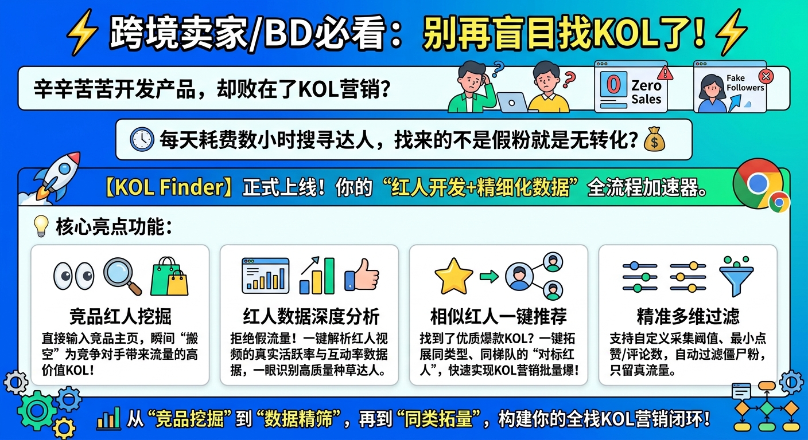
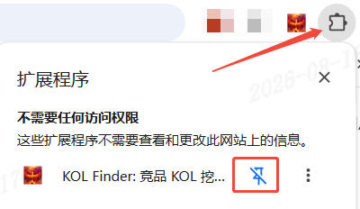
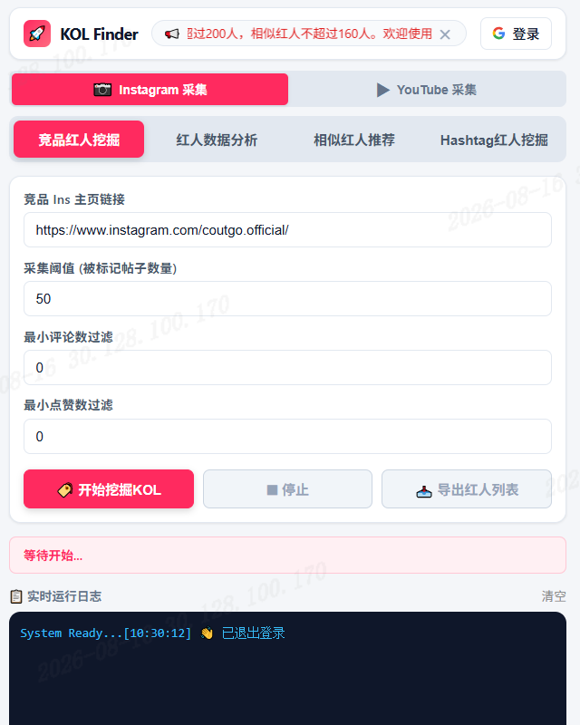
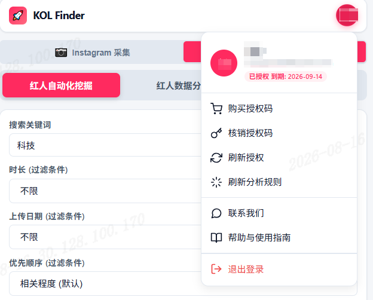

# KOL Finder Pro 用户操作手册

> 现已经更新到最新2.0版本，功能进行了重大升级!!!  

---

## 📋 目录

1. [产品简介](#一产品简介)
2. [安装与加载](#二安装与加载)
3. [界面总览](#三界面总览)
4. [登录与授权](#四登录与授权)
5. [Instagram 功能详解](#五instagram-功能详解)
   - 5.1 [竞品红人挖掘](#51-竞品红人挖掘)
   - 5.2 [红人数据分析](#52-红人数据分析)
   - 5.3 [相似红人推荐](#53-相似红人推荐)
   - 5.4 [Hashtag 红人挖掘](#54-hashtag-红人挖掘)
6. [YouTube 功能详解](#六youtube-功能详解)
   - 6.1 [红人自动化挖掘](#61-红人自动化挖掘)
   - 6.2 [红人数据分析](#62-红人数据分析)
   - 6.3 [相似红人推荐](#63-相似红人推荐)
7. [日志与任务恢复](#七日志与任务恢复)
8. [常见问题 FAQ](#八常见问题-faq)

---

## 一、产品简介

**KOL Finder ** 是一款专业的社交媒体红人（KOL）挖掘与分析工具，支持 **Instagram** 和 **YouTube** 两大平台。

### 核心能力

| 能力 | 说明 |
|------|------|
| 🔍 红人挖掘 | 根据竞品账号或话题批量发现目标红人 |
| 📊 数据分析 | 深入分析红人的发帖频率、互动率、粉丝等关键指标 |
| 🔗 相似推荐 | 基于已有红人，推荐其相似账号，快速拓展红人矩阵 |
| 📥 数据导出 | 所有采集结果支持 Excel/CSV 导出，方便二次利用 |

### 适用场景



---

## 二、安装与加载

### 2.1 安装步骤

1. 谷歌应用商店搜索  KOL Finder  或者 pathofnow

2. 在 KOL Finder  插件详情页点击「添加至 Chrome」按钮并确认授权

3. 安装完成后，在浏览器右上角扩展程序列表中将图标固定，点击即可直接启动

   

### 2.2 打开侧边栏

点击工具栏的 插件图标，侧边栏将自动展开。建议**固定**该扩展到工具栏以便快速访问。

---

## 三、界面总览




### 3.1 顶部栏

| 元素 | 功能 |
|------|------|
| 🚀 KOL Finder | 品牌标识 |
| 📢 公告栏 | 滚动显示最新公告，点击 ✕ 可关闭 |
| 「登录」按钮 | 点击进行 Google 账号登录 |
| 头像按钮 | 登录后显示，点击展开用户菜单 |

### 3.2 平台切换

在功能区上方有两个大按钮：

- **📷 Instagram 采集** — 切换到 Instagram 平台功能
- **▶ YouTube 采集** — 切换到 YouTube 平台功能

点击即可切换，每个平台有独立的功能 Tab 和配置。

### 3.3 功能 Tab

每个平台内有多个功能子 Tab，点击切换不同功能。详见后续各平台章节。

### 3.4 状态指示器

显示当前任务状态，如「等待开始...」「采集中...」「分析完成」等。

### 3.5 日志控制台

实时显示采集过程中的关键信息，帮助你了解进度和排查问题。点击右上角「清空」可清除日志。

---

## 四、登录与授权

### 4.1 Google 登录

1. 点击顶部栏的 **「登录」** 按钮
2. 在弹出的 Google 登录页面选择你的账号
3. 授权扩展获取基本信息
4. 登录成功后，按钮变为你的头像首字母

### 4.2 用户菜单

点击头像按钮展开下拉菜单：

| 菜单项 | 功能 |
|--------|------|
| 👤 用户信息 | 显示姓名、邮箱、授权状态 |
| 🛒 购买授权码 | 跳转到购买页面 |
| 🔑 核销授权码 | 输入授权码激活会员 |
| 🔄 刷新授权 | 重新验证授权状态 |
| ⚙️ 刷新分析规则 | 从服务器同步最新分析规则 |
| 💬 联系我们 | 跳转到客服页面 |
| 📖 帮助与使用指南 | 跳转到使用文档 |
| 🚪 退出登录 | 清除登录状态 |



### 4.3 授权状态说明

登录后，头像下方会显示授权状态徽章：

| 状态 | 含义 |
|------|------|
| 未授权 | 尚未激活，需要核销授权码 |
| 已授权 到期: 2027-08-24 | 正常授权，显示到期时间 |

### 4.4 核销授权码

1. 点击头像 → 「核销授权码」
2. 在弹窗中输入授权码
3. 点击「确定」完成核销

### 4.5 刷新分析规则

服务器会持续更新分析规则（如最新的 Instagram 字段路径、YouTube 选择器等）。当遇到采集异常时：

1. 点击头像 → 「刷新分析规则」
2. 选择要刷新的规则类型
3. 点击「确定」从服务器拉取最新规则

---

## 五、Instagram 功能详解

点击顶部 **📷 Instagram 采集** 切换到 Instagram 平台。

> **前置条件**：你需要在 Chrome 中已登录 Instagram 账号（https://www.instagram.com）。建议使用 Chrome 常规模式而非无痕模式。

### 5.1 竞品红人挖掘

**用途**：输入竞品/品牌方的 Instagram 主页，自动采集其帖子中@竞品/品牌方的的红人账号，形成竞品红人池。

#### 操作步骤

1. 点击 **「竞品红人挖掘」** Tab

2. 填写配置：

   | 字段 | 说明 | 示例 |
   |------|------|------|
   | **竞品 Ins 主页链接** | 竞品或品牌方的 Instagram URL | `https://www.instagram.com/coutgo.official/` |
   | **采集阈值** | 要分析的帖子数量（10-100） | `50` |
   | **最小评论数过滤** | 只保留评论数 ≥ 此值的帖子对应的红人 | `0`（不过滤） |
   | **最小点赞数过滤** | 只保留点赞数 ≥ 此值的帖子对应的红人 | `0`（不过滤） |

3. 点击 **「🏷️ 开始挖掘KOL」**

4. 等待采集完成，日志中会显示进度

5. 点击 **「📥 导出红人列表」** 下载 Excel 结果

#### 采集流程

```
1. 打开竞品主页 → 滚动加载帖子
2. 提取帖子中的 @竞品/品牌方的的红人账号  的kol用户名
3. 自动去重、过滤（评论数/点赞数）
4. 汇总红人列表 → 可导出
```

#### 结果字段说明

| 字段 | 含义 |
| :--- | :--- |
| 账户名称 | 红人的 Instagram 用户名 |
| 帖子链接 | 发现该红人的帖子 URL |
| 媒体类型 | 图片/视频/轮播图文 |
| 点赞数 | 该帖子的点赞数 |
| 评论数 | 该帖子的评论数 |
| 帖子内容 | 该帖子包含的文案或文字描述 |
| 用户主页链接 | 红人的 Instagram 主页 URL |
| 粉丝数 | 红人当前的关注者数量 |
| 帖子总数 | 红人累计发布的帖子数量 |
| 用户简介 | 红人主页的个人介绍 |
| 邮箱 | 红人简介里面公开的联系邮箱 |
| 关注数 | 红人关注的其他账号数量 |
| 昵称 | 红人主页显示的真实姓名或昵称 |
| 是否认证 | 红人是否拥有 Instagram 官方认证（蓝V） |
| 账户所在地 | 红人账号所属的国家或地区 |
| 加入日期 | 红人入驻该平台的日期 |
| 分析视频数 | 红人活跃度和互动率分析覆盖的红人视频样本总数 |
| 总跨越天数 | 红人视频样本总数中视频发布时间最早和最晚的间隔天数 |
| 平均发帖间隔天数 | 平均每个帖子之间的发布时间间隔（天） |
| 周均发帖频次 | 每周平均发布帖子的数量 |
| 活跃度标签 | 基于发帖频次等指标给出的活跃程度分类标签 |
| 平均点赞数 | 分析周期内所有帖子的平均点赞数 |
| 平均评论数 | 分析周期内所有帖子的平均评论数 |

> 💡 **提示**：如需 要指定分析红人视频的样本数 或者需要还需要分析平均播放数，需要使用「红人数据分析」功能进一步分析。

---

### 5.2 红人数据分析

**用途**：对单个红人进行深度画像分析，获取粉丝数、帖子数、活跃度、互动率等关键指标。

#### 操作步骤

1. 点击 **「红人数据分析」** Tab

2. 填写配置：

   | 字段 | 说明 | 示例 |
   |------|------|------|
   | **红人 Ins 主页链接** | 目标红人的 Instagram URL | `https://www.instagram.com/sportscenter` |
   | **采集阈值** | 分析近 N 条动态（5-100） | `20` |

3. 点击 **「📈 开始分析红人」**

4. 等待采集完成，日志中会显示分析进度

5. 点击 **「📄 导出分析报告」** 下载 Excel 结果

#### 分析流程

```
1. 打开红人主页 → 采集账户信息（粉丝数、帖子数、认证状态）
2. 采集最近 N 条帖子 → 获取每条的点赞数、评论数、发布时间
3. 采集 Reels 数据 → 获取播放量
4. 合并帖子 + Reels 数据 → 计算各项指标
5. 输出分析报告
```

#### 分析指标说明

| 指标 | 计算方式 | 含义 |
|------|---------|------|
| 粉丝数 | Instagram 原始数据 | 红人当前粉丝量 |
| 帖子总数 | Instagram 原始数据 | 红人发布的总帖子数 |
| 账户所在地 | About This Account 数据 | 红人注册地区 |
| 加入日期 | About This Account 数据 | 账号创建时间 |
| 平均点赞数 | 近 N 条帖子点赞数平均值 | 红人内容的基础受欢迎度 |
| 平均评论数 | 近 N 条帖子评论数平均值 | 红人粉丝互动深度 |
| 平均播放数 | 近 N 条帖子播放数平均值 | 红人视频的触达力 |
| 活跃率 | 发帖频率分析 | 红人的内容产出活跃度 |
| 互动率 | (点赞+评论)/粉丝数 | 红人粉丝互动质量 |

#### 日志关键字解读

```
📊 账户信息: ufc | 粉丝=50452754 | 帖子=46927 | 认证=true    ← 账户基本信息
📥 首屏重放：1 条响应，12 edges → 12 有效节点                   ← 首屏帖子捕获
📊 已采集 10 条帖子（获取12条，过滤2条（置顶=2））...            ← 过滤说明
📊 简介: 所在地=美国 | 加入=2012年2月                           ← About This Account
🎬 跳转 Reels 页面                                              ← Reels 采集
📊 已收集 12 条 Reels...                                        ← Reels 数量
🔗 合并 Reels 播放数据到帖子                                     ← 数据合并
📊 帖子 10 条 | Reels 24 条                                      ← 合并结果
✅ 匹配到播放数: 10/10 条                                        ← 播放数匹配
📈 分析帖子活跃度+互动率...                                      ← 指标计算
```

---

### 5.3 相似红人推荐

**用途**：指定一个标杆红人，自动推荐 Instagram 平台上的相似红人账号，快速拓展红人矩阵。

#### 操作步骤

1. 点击 **「相似红人推荐」** Tab

2. 填写配置：

   | 字段 | 说明 | 示例 |
   |------|------|------|
   | **对标红人 Ins 主页链接** | 标杆红人的 Instagram URL | `https://www.instagram.com/sportscenter` |
   | **采集阈值** | 推荐数量（5-100） | `50` |

3. 点击 **「🔍 开始推荐相似红人」**

4. 等待采集完成

5. 点击 **「📥 导出推荐列表」** 下载结果

#### 推荐流程

```
1. 打开标杆红人主页 → 采集账户信息
2. 逐个跳转推荐红人主页 → 进行深度画像分析
3. 汇总推荐列表 → 可导出
```

> 💡 **提示**：每天不要频繁大量使用，每天建议不超过160个相似红人，如果超过，有可能会被 ins平台限制24小时内，不能使用该功能。

---

### 5.4 Hashtag 红人挖掘

**用途**：通过话题标签（Hashtag）挖掘相关红人，适合按领域/主题发现红人。

#### 操作步骤

1. 点击 **「Hashtag红人挖掘」** Tab

2. 填写配置：

   | 字段 | 说明 | 示例 |
   |------|------|------|
   | **话题标签** | 要搜索的 Hashtag（无需 # 号） | `fashion` |
   | **采集阈值** | 分析帖子数量（10-100） | `30` |
   | **最小评论数过滤** | 只保留评论数 ≥ 此值的帖子对应的红人 | `0`（不过滤） |
   | **最小点赞数过滤** | 只保留点赞数 ≥ 此值的帖子对应的红人 | `0`（不过滤） |

3. 点击 **「开挖挖掘红人」**

#### 采集流程

```
1.打开hashtag关键词搜索页 → 滚动加载帖子
2. 提取帖子中的 的kol用户名
3. 自动去重、过滤（评论数/点赞数）
4. 汇总红人列表 → 可导出
```

#### 结果字段说明

| 字段             | 含义                                               |
| :--------------- | :------------------------------------------------- |
| 账户名称         | 红人的 Instagram 用户名                            |
| 帖子链接         | 发现该红人的帖子 URL                               |
| 媒体类型         | 图片/视频/轮播图文                                 |
| 点赞数           | 该帖子的点赞数                                     |
| 评论数           | 该帖子的评论数                                     |
| 帖子内容         | 该帖子包含的文案或文字描述                         |
| 用户主页链接     | 红人的 Instagram 主页 URL                          |
| 粉丝数           | 红人当前的关注者数量                               |
| 帖子总数         | 红人累计发布的帖子数量                             |
| 用户简介         | 红人主页的个人介绍                                 |
| 邮箱             | 红人简介里面公开的联系邮箱                         |
| 关注数           | 红人关注的其他账号数量                             |
| 昵称             | 红人主页显示的真实姓名或昵称                       |
| 是否认证         | 红人是否拥有 Instagram 官方认证（蓝V）             |
| 账户所在地       | 红人账号所属的国家或地区                           |
| 加入日期         | 红人入驻该平台的日期                               |
| 分析视频数       | 红人活跃度和互动率分析覆盖的红人视频样本总数       |
| 总跨越天数       | 红人视频样本总数中视频发布时间最早和最晚的间隔天数 |
| 平均发帖间隔天数 | 平均每个帖子之间的发布时间间隔（天）               |
| 周均发帖频次     | 每周平均发布帖子的数量                             |
| 活跃度标签       | 基于发帖频次等指标给出的活跃程度分类标签           |
| 平均点赞数       | 分析周期内所有帖子的平均点赞数                     |
| 平均评论数       | 分析周期内所有帖子的平均评论数                     |

> 💡 **提示**：如需 要指定分析红人视频的样本数 或者需要还需要分析平均播放数，需要使用「红人数据分析」功能进一步分析。


---

## 六、YouTube 功能详解

点击顶部 **▶ YouTube 采集** 切换到 YouTube 平台。

> **前置条件**：需要在 Chrome 中登录 YouTube/Google 账号。建议使用与授权时相同的 Google 账号以获得最佳体验。

### 6.1 红人自动化挖掘

**用途**：根据关键词在 YouTube 搜索结果中批量挖掘红人频道，获取频道信息和视频数据。

#### 操作步骤

1. 点击 **「红人自动化挖掘」** Tab

2. 填写配置：

   | 字段 | 说明 | 示例 |
   |------|------|------|
   | **搜索关键词** | YouTube 搜索关键词 | `科技` |
   | **时长** | 视频时长过滤 | `不限` / `3分钟以下` / `3-20分钟` / `20分钟以上` |
   | **上传日期** | 上传时间过滤 | `不限` / `今天` / `本周` / `本月` / `今年` |
   | **优先顺序** | 排序方式 | `相关程度` / `上传日期` / `热门程度` |
   | **目标采集视频数量** | 要分析的视频数量 | `30` |
   | **开启深度采集** | 是否深入采集点赞/评论/频道信息 | ✅ 勾选 |

3. 点击 **「▶ 开始挖掘KOL」**

4. 等待采集完成

5. 点击 **「📥 导出结果」** 下载 Excel

#### 采集流程

```
1. 在 YouTube 搜索页输入关键词 → 应用过滤条件
2. 滚动搜索结果页 → 收集视频列表
3. 进入每个视频详情页 → 提取：
   - 标题、链接、频道名
   - 观看数、点赞数、评论数
   - 发布日期（转换为中国标准时间）
   - 频道订阅数
4. 自动去重 → 汇总红人列表 → 可导出
```

#### 关于深度采集

勾选「开启深度采集」后，系统会：

- 进入每个视频详情页获取**精确的观看数**（覆盖搜索页的估算值）
- 提取视频**评论数**（需要滚动加载）
- 获取**频道信息**（订阅数、频道链接）

> ⏱ 深度采集会增加采集时间，但数据更准确。如果只需要视频列表，可取消勾选。

#### 结果字段说明

| 字段 | 含义 |
|------|------|
| 视频标题 | YouTube 视频标题 |
| 视频链接 | 视频 URL（ Shorts 链接自动转换为标准格式） |
| 频道名称 | 发布视频的频道名 |
| 频道链接 | 频道 URL |
| 观看数 | 视频播放量 |
| 订阅者数 | 粉丝数量 |
| 总视频数 | 发布的总视频数 |
| 总观看数 | 所有视频的总观看数 |
| 点赞数 | 视频点赞数 |
| 评论数 | 视频评论数 |
| 发布时间 | 视频的发布时间 |
| 国家     | 博主的地理位置 |
| 频道简介 | 描述频道的内容 |
| 邮箱     | 描述内容中 公布的 公开邮箱 |

### 6.2 红人数据分析

**用途**：对 YouTube 红人频道进行深度分析。

> ⚠️ **注意**：此功能正在开发中，当前按钮为灰色预留状态。

---

### 6.3 相似红人推荐

**用途**：基于标杆 YouTube 红人推荐相似频道。

> ⚠️ **注意**：此功能正在开发中，当前按钮为灰色预留状态。

---

## 七、日志与任务恢复

### 7.1 日志控制台

侧边栏底部的黑色控制台实时显示采集日志：

```
[14:43:23] 🔗 跳转红人主页: https://www.instagram.com/ufc
[14:43:30]   └─ 📂 主页加载完成，渲染等待 5553ms
[14:43:30]   └─ ⏳ 等待账户数据...
[14:43:31]   └─ 📊 账户信息: ufc | 粉丝=50452754 | 帖子=46927 | 认证=true
[14:43:31]   └─ 📥 首屏重放：1 条响应，12 edges → 12 有效节点
[14:43:37]   └─ 📊 已采集 10 条帖子...
[14:43:52]   └─ ✅ 匹配到播放数: 10/10 条
[14:43:52]   └─ 📈 分析帖子活跃度+互动率...
[14:43:55]   └─ 📊 分析完成！
[14:43:55] 🎉 任务全部结束！
```

#### 日志级别说明

| 图标 | 含义 |
|------|------|
| 🔗 | 页面跳转 |
| 📂 | 页面加载完成 |
| ⏳ | 等待数据中 |
| 📊 | 数据统计/进度 |
| 📥 | 首屏数据捕获 |
| ✅ | 操作成功 |
| 🎉 | 任务完成 |
| ⚠️ | 警告（如「标签页不在前台」） |
| ❌ | 错误 |

### 7.2 任务恢复

当你关闭侧边栏或浏览器后，下次打开时系统会检测未完成的任务：

```
🔄
检测到未完成的任务
红人挖掘 - Instagram pubity (4/6)

[继续任务] [放弃]
```

- 点击 **「继续任务」** 从上次断点继续采集
- 点击 **「放弃」** 清除未完成任务

> 💡 任务恢复功能支持「竞品红人挖掘」和「相似红人推荐」两个需要批量处理的功能。单次分析（如红人数据分析）不支持恢复。

### 7.3 数据导出

每个功能完成后，对应的「📥 导出」按钮会变为可用状态：

1. 点击 **「📥 导出红人列表」** / **「📄 导出分析报告」** / **「📥 导出结果」**
2. 浏览器自动下载 Excel 文件
3. 文件名格式：`{功能类型}_{时间戳}.xlsx`

> ⚠️ **注意**：导出按钮在采集完成前为灰色不可点击状态。

---

## 八、常见问题 FAQ

### Q1: 采集时提示「标签页不在前台」怎么办？

**A**: 请将 Instagram/YouTube 页面标签页保持在前台。Chrome 扩展在后台标签页中无法正常触发页面滚动和数据加载。

### Q2: Instagram 采集一直显示「已采集 0 条」怎么办？

**A**: 这通常是过滤条件过严导致的。尝试：

1. 将「最小评论数」和「最小点赞数」都设为 `0`
2. 如果仍然为 0，可能是该红人确实没有公开帖子（私密账号）或全是图片（设置了「仅视频」过滤）

### Q3: YouTube 评论数显示为「0」或一直在加载？

**A**: YouTube 评论需要滚动触发懒加载。请确保：
1. 视频详情页在前台
2. 开启了「深度采集」
3. 网络状况良好

### Q4: 如何停止正在运行的任务？

**A**: 点击对应功能的 **「⏹ 停止」** 按钮。已采集的数据会保留，可以继续导出。

### Q5: 刷新页面后之前的数据还在吗？

**A**: 已完成并导出的数据已下载到本地。正在进行的任务会保存进度，下次打开侧边栏时可以恢复。

### Q6: Instagram 采集需要登录吗？

**A**: 需要。你必须在 Chrome 中登录 Instagram 账号才能正常采集。未登录状态下 Instagram 会限制 访问红人主页。

### Q8: 采集速度慢怎么办？

**A**: 采集速度受以下因素影响：
- **网络延迟**：Instagram/YouTube 服务器响应速度
- **反爬检测**：系统内置了随机延迟，模拟人工操作，防止被限制
- **数据量**：阈值越大，采集时间越长
- **建议**：保持页面在前台，避免系统休眠

### Q9: 数据安全吗？

**A**: 所有采集数据仅保存在你的本地浏览器中，不会上传到任何服务器。扩展遵循 Chrome 扩展隐私政策。

---

## 附录：功能对照表

| 平台 | 功能 | 输入 | 输出 |
|------|------|------|------|
| Instagram | 竞品红人挖掘 | 竞品主页 URL | 红人列表（含帖子信息） |
| Instagram | 红人数据分析 | 红人主页 URL | 深度画像报告 |
| Instagram | 相似红人推荐 | 标杆红人 URL | 推荐红人列表 |
| Instagram | Hashtag 红人挖掘 | Hashtag 关键词 | 待开发 |
| YouTube | 红人自动化挖掘 | 搜索关键词 | 视频/红人列表 |
| YouTube | 红人数据分析 | 频道 URL | 待开发 |
| YouTube | 相似红人推荐 | 标杆红人 URL | 待开发 |

---


